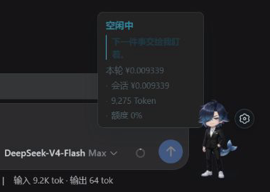
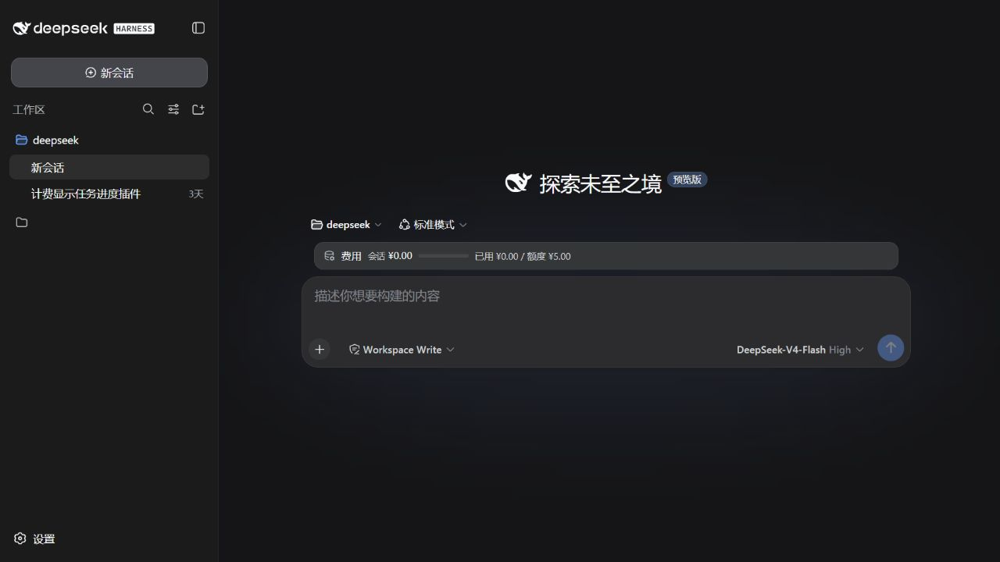
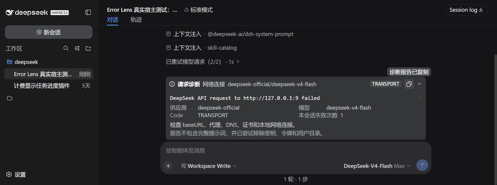
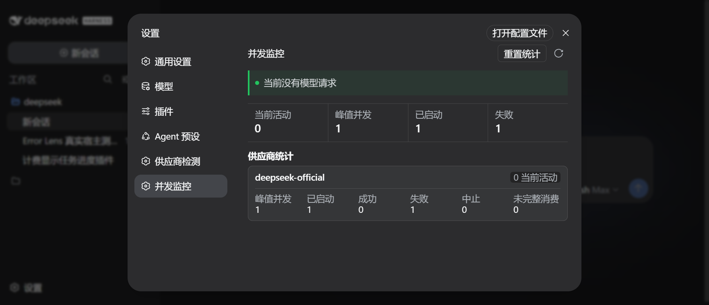
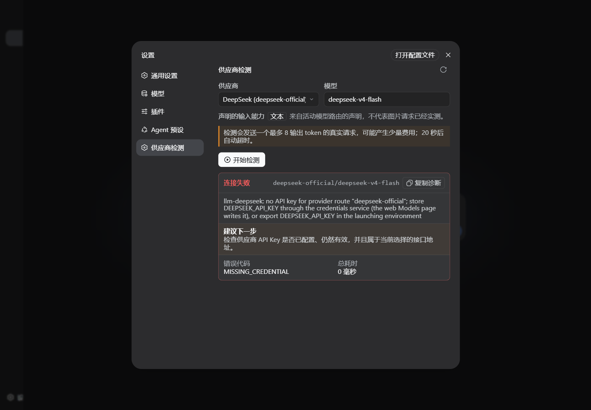

# DeepSeek Harness 0.1.1-rc.2 更新：图片链路升级，我也同步优化了 6 个实用插件

DeepSeek Harness 在 8 月 21 日晚发布了 `0.1.1-rc.2`。这次官方更新不算大，但方向很明确：继续把图片输入链路做稳。与此同时，我把自己维护的 6 个社区插件全部切到 `rc.2` 作为当前开发验证基线，并针对日常使用中容易出现的性能、卡顿、诊断和打包问题做了一轮小版本更新。

如果用一句话概括这次同步更新，就是：**官方把图片能力做稳，社区插件把日常使用做顺。**

> 本文提到的插件均为独立社区项目，不属于 DeepSeek 官方发行版，也不代表官方提供支持或背书。

## 官方 rc.2 更新了什么

根据 [DeepSeek Harness v0.1.1-rc.2 Release](https://github.com/deepseek-ai/deepseek-harness/releases/tag/dsh-v0.1.1-rc.2)，本次正式公布了两项改进：

1. DeepSeek 适配器优先通过 Files API 上传图片，并复用已经上传的文件。
2. 图片预处理会根据模型要求自动缩放，并转换成合适的格式。

这两项看起来都是底层细节，但对实际体验很重要。过去图片可能随着请求重复进入传输链路，大图、特殊格式或方向信息也更容易在不同模型和供应商之间产生兼容问题。现在由适配器统一处理上传、复用、尺寸和格式，调用方不需要各自重复实现一套图片预处理。

需要注意的是，这不等于所有模型突然都拥有识图能力。模型本身是否支持图片、供应商是否开放对应接口、路由是否声明图片输入能力，仍然是前提。`rc.2` 改进的是“图片怎样更可靠地送到支持它的模型”，而不是绕过模型能力限制。

## 为什么插件也要跟着更新

Harness 仍处于 RC 阶段，Session Projection、Web Slot、Remote API 和客户端包会继续演进。插件如果只在旧版能编译，并不代表在新版宿主中仍然可靠。因此这次没有简单地把依赖版本改成 `rc.2`，而是对每个项目重新执行类型检查、单元测试、生产构建和安装包内容校验。

最后 6 个仓库的 `npm run verify` 全部通过，共计 **135 个测试**：

| 项目 | 新版本 | 本次重点 |
| --- | --- | --- |
| dsh-companion | `0.1.10` | 适配新版 Projection API，减少无意义刷新并缩小安装包 |
| dsh-billing | `0.6.3` | 补齐 Host、Web、测试、构建和打包的完整验证链路 |
| dsh-error-lens | `0.1.2` | 增加最近失败记录，并加强错误标识脱敏与长度限制 |
| dsh-concurrency-meter | `0.1.2` | 活跃时保持实时刷新，空闲时自动降低轮询频率 |
| dsh-provider-probe | `0.3.2` | 单个供应商模型目录超时不再阻塞整个页面 |
| dsh-plugin-git-inspect | `0.3.2` | 增加安装包校验，并在 Windows、Ubuntu 双平台运行 CI |

## Companion：更轻，也更安静

`dsh-companion 0.1.10` 是这轮变化最多的一个。它是一个本地、状态感知的 Harness Web 桌面伙伴，会根据思考、工具调用、完成和失败状态显示不同动作与反馈。

新版适配了 `0.1.1-rc.2` 的 Projection 定义，同时不再因为每个流式文本片段都更新状态。运行计时从每 500 毫秒刷新一次调整为每秒一次，视觉上没有明显损失，但能减少浏览器端重复渲染。浏览器 source map 也不再进入发布包，安装包从此前约 307 KB 降到 **207.2 KB**。

插件仍然只保留状态、轮次、工具名称、时间和短错误码，不读取提示词、模型回复、工具参数、文件内容或工作区路径，也不会发送遥测。

项目地址：[Wanbinyu/dsh-companion](https://github.com/Wanbinyu/dsh-companion)

## Billing：让本地费用更容易核对

`dsh-billing 0.6.3` 按 provider/model 统计 Token 和参考费用，并在输入区显示本轮费用、会话累计、额度进度与未定价模型。相同模型经过不同供应商时会分开统计，避免把不同价格混在一起。

本次主要是工程稳定性更新：用 `rc.2` 重新验证 Host projection 和 Web 费用条，并把类型检查、45 个测试、完整构建和发布包校验合并为统一流程。费用仍然只是根据本地价格配置计算的参考值，不是供应商账单，也不会替用户自动阻断请求。

项目地址：[Wanbinyu/dsh-billing](https://github.com/Wanbinyu/dsh-billing)

## Error Lens：失败信息更完整，但仍保持脱敏

`dsh-error-lens 0.1.2` 会把 401、403、429、超时、网络、上下文限制和服务端错误整理成可操作的诊断。新版除了当前错误，还可以展开查看最近 3 条此前失败，方便判断问题是偶发还是重复出现。

错误码和 Request ID 增加了脱敏、控制字符清理与 128 字符上限。插件不会读取 API Key，也不会保存提示词或模型回复；复制诊断报告后，公开前仍建议人工检查一次。

项目地址：[Wanbinyu/dsh-error-lens](https://github.com/Wanbinyu/dsh-error-lens)

## 并发监控与供应商检测：减少空转，避免一处卡住全局

`dsh-concurrency-meter 0.1.2` 在存在活动请求时每秒刷新，空闲时自动降为每 5 秒刷新。这样既保留了长任务期间的实时感，也避免设置页空闲时持续高频轮询。它只观察并发，不排队、不限流，也不修改模型调用。

`dsh-provider-probe 0.3.2` 为每个供应商的模型目录读取增加独立超时。某个第三方接口一直不返回时，其他供应商仍能正常显示，整个检测页不会被一个异常连接拖住。真正的连通性检测仍需用户手动点击才会发出一个极小请求，不会在后台自动产生模型费用。

项目地址：[dsh-concurrency-meter](https://github.com/Wanbinyu/dsh-concurrency-meter) · [dsh-provider-probe](https://github.com/Wanbinyu/dsh-provider-probe)

## Git Inspect：继续坚持只读边界

`dsh-plugin-git-inspect 0.3.2` 为 Agent 提供 Git 状态、diff、历史、refs、冲突、blame、stash 和 worktree 等 10 个只读工具。它不提供 commit、push、reset 或切换分支，所有 Git 调用都使用固定参数执行，不经过 shell。

这次没有扩大权限，而是补齐发布包内容检查，并把 GitHub Actions 扩展到 Ubuntu 和 Windows。对这种会接触本地仓库的插件来说，跨平台验证和明确的只读边界比堆叠更多写操作更重要。

项目地址：[Wanbinyu/dsh-plugin-git-inspect](https://github.com/Wanbinyu/dsh-plugin-git-inspect)

## 安装与后续

所有新版安装包、精确版本和兼容范围已经整理到独立目录：

[Wanbinyu Harness 工具箱](https://github.com/Wanbinyu/wanbinyu-harness-toolbox)

每个插件仓库的 README 都提供完整安装、配置、卸载、隐私边界和当前限制。更新前建议先确认自己的 Harness 版本，并优先使用 Release 中固定版本的 `.tgz`，避免默认分支继续变化后难以复现。

这轮更新没有追求“大功能”，而是优先处理兼容、卡顿、超时隔离、隐私边界和可验证发布。Harness 的官方能力继续向前走时，社区插件也需要用同样的标准保持可安装、可解释、可回退。

官方项目：[deepseek-ai/deepseek-harness](https://github.com/deepseek-ai/deepseek-harness)

